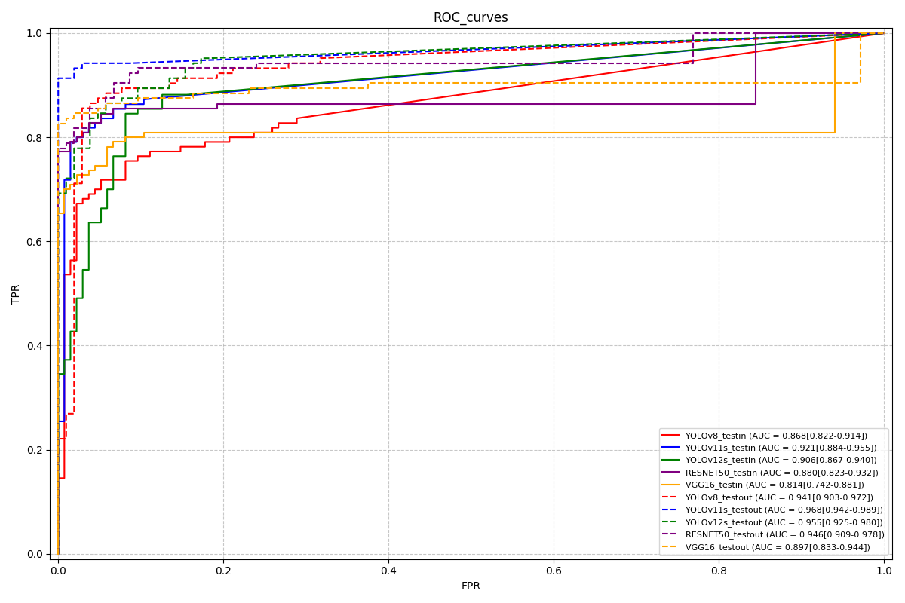
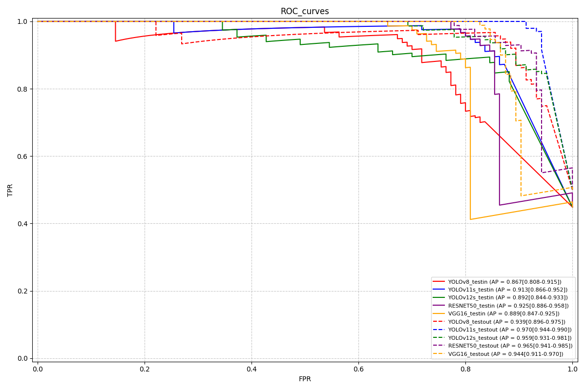

# fracture-detection-code

Official PyTorch Implementation of Deep Learning Model for Automated Detection of Pediatric Femoral Neck Fractures on Hip Radiographs:A Multicenter Study with Clinical Utility Assessment

## code

The code is divided into two parts:

- faster-rcnn: This is the implementation of the Faster-RCNN model ( resnet-50 backbone and vgg16 backbone ) for fracture detection.
- for_yolov8v11v12: This is the implementation of the YOLOv8, YOLOv11, and YOLOv12 models for fracture detection.

The structure of the code directory is as follows:
```shell
code/
|---- faster-rcnn/
|---- ---- train.py
|---- ---- test.py
|---- for_yolov8v11v12/
|---- ---- train.py
|---- ---- test.py
```

Environment:

for faster-rcnn:
```
cd ./code/faster-rcnn
pip install -r requirements.txt
```

for for_yolov8v11v12:
```
cd ./code/for_yolov8v11v12
pip install -r requirements.txt
```

## Datasets
The datasets strcutre for YOLOv8, YOLOv11, and YOLOv12 is as follows:
```shell
data/
|---- train/
|---- ---- images/
|---- ---- labels/
|---- val/
|---- ---- images/
|---- ---- labels/
|---- test/
|---- ---- images/
|---- ---- labels/
```

The datasets strcutre for Faster-RCNN is as follows:
```shell
VOC2007/
|---- Annotations/
|---- ---- *.xml
|---- ImageSets/
|---- ---- Main/
|---- *.txt
|---- JPEGImages/
|---- ---- *.jpg
```

## Environment
This codes is tested on Python 3.8.
To install requirements:

```setup
cd ./code/faster-rcnn
pip install-r requirements.txt
```

```setup
cd ./code/for_yolov8v11v12
pip install-r requirements.txt
```


### Usage
To train fasterrcnn model, you can set your parammers（such as the type of model, the number of epochs, and the learning rate and so on） in ***train_vgg.py*** and ***train_res50.py*** ,and then run:


```train
cd ./code/faster-rcnn
python train_vgg.py
python train_res50.py
```

To test fasterrcnn modelin the test set, please set your parammers in ***get_classification_metrics.py*** , run:

```test
cd ./code/faster-rcnn
python test.py
```

To train the YOLOv8, YOLOv11, and YOLOv12 models,you can set your parammers（such as the type of model, the number of epochs, and the learning rate and so on） in ***train.py*** and then run:

```train
cd ./code/for_yolov8v11v12
python train.py
```

To get the results of the YOLOv8, YOLOv11, and YOLOv12 models in the test set, please set your parammers in ***get_classification_metrics.py*** , run:

```test
cd ./code/for_yolov8v11v12
python get_classification_metrics.py*
``` 

### Result
The results of the YOLOv8, YOLOv11, YOLOv12 and Faster-RCNN models in the test set are as follows:







